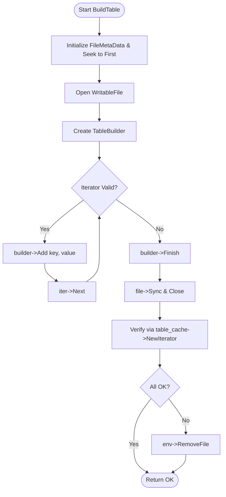

### File Overview
`db/builder.cc` provides a high-level utility function, `BuildTable`, used to create a new SSTable file from a sorted iterator. It acts as a bridge between the database's high-level compaction/flush logic (called by `db_impl.cc` and `repair.cc`) and the low-level `TableBuilder` class.

### Key Symbol Annotations
- `BuildTable` — Orchestrates the creation of an SSTable by iterating through a provided `Iterator`, writing data via a `TableBuilder`, and updating `FileMetaData` (smallest/largest keys and file size).

### Design Patterns & Engineering Practices
- **Resource Management (Manual RAII)**: The code demonstrates a strict "create-use-delete" pattern for `TableBuilder` and `WritableFile`. While not using `std::unique_ptr` (consistent with the pre-C++11 style of the core library), it ensures that `delete builder` and `delete file` are called regardless of whether the process succeeded, provided the function doesn't return early.
- **Defensive File Handling**: The function implements a "transactional" approach to file creation. If any step fails (writing, syncing, or the final verification check), `env->RemoveFile(fname)` is called to ensure no corrupted or partial SSTables are left on disk.
- **Post-Write Verification**: A notable engineering practice is seen in the final block where a new `Iterator` is created from the `table_cache` to verify the table is actually usable before the function returns success. This prevents "silent" corruption where a file is written but cannot be read.
- **Metadata Extraction**: The use of `meta->smallest.DecodeFrom(iter->key())` shows how LevelDB extracts internal keys to maintain the range boundaries of each SSTable, which is critical for the LSM-tree's read path to skip irrelevant files.

### Internal Flow

### Questions
- **Line 54**: The check `if (s.ok() && meta->file_size > 0)` implies that a file with size 0 is considered a failure. Is there a scenario where a valid SSTable could be empty, or does the LSM-tree invariant forbid empty tables?
