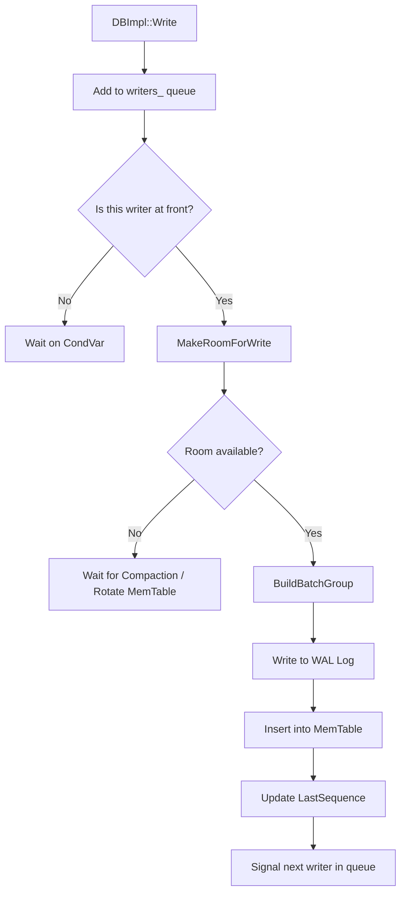

### File Overview
`db/db_impl.cc` is the core implementation of the LevelDB database, providing the concrete logic for the `DB` public interface. It manages the high-level orchestration of the LSM-tree, including the write path (WAL and MemTable), the read path (searching through memory and SSTables), and the background compaction process.

### Key Symbol Annotations
- `DBImpl` — The primary class implementing the database logic, managing the lifecycle of the `VersionSet`, `MemTable`, and `TableCache`.
- `Write` — Orchestrates the write path: groups concurrent writes into batches, appends them to the WAL, and inserts them into the current `MemTable`.
- `Get` — Implements the read path: checks the `MemTable`, then the immutable `MemTable`, and finally the SSTables via the `Version` object.
- `MakeRoomForWrite` — Ensures there is sufficient memory in the `MemTable` and that L0 files haven't exceeded limits before allowing a write.
- `BackgroundCompaction` — The background worker logic that decides whether to flush a `MemTable` to L0 or merge SSTables across levels.
- `DoCompactionWork` — The heavy-lifting function that iterates through input files, filters obsolete keys, and writes new SSTables.
- `Recover` — Handles database startup by locking the DB and replaying WAL logs to reconstruct the `MemTable`.
- `RemoveObsoleteFiles` — Garbage collects SSTables and logs that are no longer referenced by any active `Version`.

### Design Patterns & Engineering Practices
- **Pimpl-like Interface Separation**: While not a strict Pimpl, `DBImpl` inherits from the abstract `DB` class, keeping the public API in `include/leveldb/db.h` clean and the implementation details private.
- **Manual Reference Counting**: LevelDB uses `Ref()` and `Unref()` (e.g., on `MemTable` and `Version` objects) instead of `std::shared_ptr` to minimize overhead and maintain precise control over object lifetimes in a performance-critical path.
- **Write Grouping (Batching)**: In `BuildBatchGroup`, LevelDB implements a "group commit" pattern. It collects multiple concurrent write requests into a single larger batch to amortize the cost of disk I/O (WAL sync).
- **Fine-Grained Locking with `mutex_.Unlock()`**: To prevent the global `DBImpl::mutex_` from becoming a bottleneck, the code strategically unlocks the mutex during expensive I/O operations (e.g., in `Get` and `DoCompactionWork`) and re-locks it to update state.
- **State-Based Background Coordination**: The use of `background_work_finished_signal_` (a `CondVar`) allows the foreground write thread to block efficiently in `MakeRoomForWrite` until the background compaction thread clears space.
- **RAII for Resource Management**: Use of `MutexLock l(&mutex_)` ensures that locks are always released when a function returns, regardless of the exit path.

### Internal Flow

#### Write Path Flow


#### Compaction Decision Flow
```mermaid
flowchart TD
    A[BGWork / BackgroundCall] --> B{Is there an immutable MemTable?}
    B -- Yes --> C[CompactMemTable: Flush to L0]
    B -- No --> D{Is there a Manual Compaction?}
    D -- Yes --> E[CompactRange]
    D -- No --> F[PickCompaction: L0 -> L1 or L(n) -> L(n+1)]
    F --> G{Is it a Trivial Move?}
    G -- Yes --> H[Update Manifest: Move file to next level]
    G -- No --> I[DoCompactionWork: Merge and Filter]
    I --> J[InstallCompactionResults]
```

### Questions
- **Line 835**: In `DoCompactionWork`, the logic for dropping deletion markers (`ikey.type == kTypeDeletion`) is complex. It requires verification if the "base level" check is sufficient to prevent premature deletion of markers needed by older snapshots.
- **Line 1155**: The `BuildBatchGroup` logic switches to `tmp_batch_` if the first writer's batch is modified. The exact ownership and clearing cycle of `tmp_batch_` relative to the caller's `WriteBatch` warrants a closer look to ensure no memory leaks or double-frees occur.
