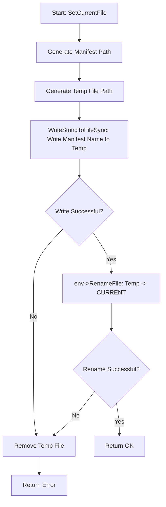

### File Overview
`db/filename.cc` is a utility module responsible for generating and parsing the standardized filenames used by LevelDB to organize its on-disk storage. It serves as the central authority for naming conventions for WAL logs, SSTables, manifests, and lock files, and is called extensively by `DBImpl` and `Builder` to manage file lifecycles.

### Key Symbol Annotations
- `MakeFileName` — Internal helper that formats a numeric ID and suffix into a standardized path string.
- `LogFileName` / `TableFileName` / `SSTTableFileName` — Generate paths for write-ahead logs and sorted string tables respectively.
- `DescriptorFileName` — Generates the path for the MANIFEST file, which tracks the database state.
- `CurrentFileName` — Returns the path to the `CURRENT` file, which points to the latest manifest.
- `ParseFileName` — Deconstructs a filename string to determine its `FileType` and associated sequence number.
- `SetCurrentFile` — Atomically updates the `CURRENT` file to point to a new manifest using a temporary file and a rename operation.

### Design Patterns & Engineering Practices
- **Atomic File Updates**: In `SetCurrentFile`, LevelDB avoids writing directly to the `CURRENT` file. Instead, it writes to a `TempFileName` and then calls `env->RenameFile`. This ensures that if the system crashes during the write, the `CURRENT` file remains intact and points to a valid (albeit older) manifest, preventing database corruption.
- **Locale Independence**: In `ParseFileName`, the code explicitly avoids `strtoull()` in favor of `ConsumeDecimalNumber`. This is a critical engineering detail to ensure that the database files are portable across different systems regardless of the local language/region settings (which can affect how numbers are parsed).
- **Defensive Programming**: The use of `assert(number > 0)` in naming functions ensures that internal sequence numbers are valid before attempting to create files on disk.
- **Pimpl-like Separation**: By isolating all naming logic in this file, the rest of the system (like `DBImpl`) does not need to know the specific string formats (e.g., `"/MANIFEST-%06llu"`) used on disk, making it easier to change the file format in the future.

### Internal Flow
The `SetCurrentFile` function implements a classic "write-then-rename" pattern to ensure atomicity:

