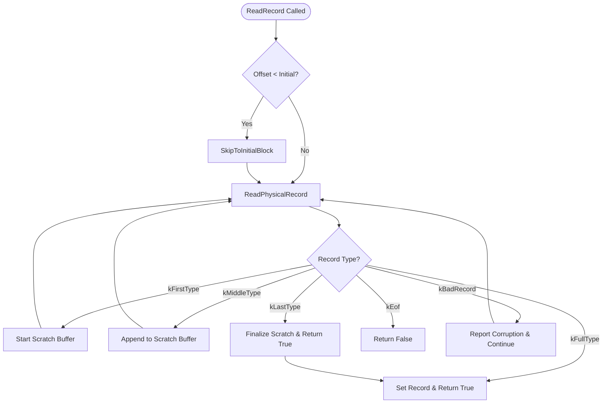

### File Overview
`db/log_reader.cc` implements the logic for reading and parsing the Write-Ahead Log (WAL) files. It acts as a layer between the raw `SequentialFile` and the database recovery/dumping logic (called by `DBImpl` and `repair.cc`), transforming a stream of bytes into logical records while handling fragmentation and corruption.

### Key Symbol Annotations
- `Reader` — The primary class responsible for reading physical records from a log file and assembling them into logical records.
- `ReadRecord` — The main public interface that returns a complete logical record, handling the assembly of fragmented records (`kFirstType`, `kMiddleType`, `kLastType`).
- `ReadPhysicalRecord` — An internal helper that parses the low-level log format (header, CRC, length, and type) from the buffer.
- `SkipToInitialBlock` — Aligns the file pointer to the nearest block boundary relative to `initial_offset_` to optimize the start of a read.
- `ReportCorruption` / `ReportDrop` — Mechanisms to notify a `Reporter` object when data is missing or corrupted, ensuring the DB can track data loss.
- `LastRecordOffset` — Returns the byte offset of the most recently successfully read logical record.

### Design Patterns & Engineering Practices
- **Pimpl-like Separation**: While not a strict Pimpl, the `Reader` uses a `Reporter` interface to decouple the detection of corruption from the policy of how to handle it (e.g., whether to crash or just log a warning).
- **Buffer Management**: The use of `Slice` (a lightweight pointer/length pair) throughout `ReadRecord` and `ReadPhysicalRecord` avoids unnecessary string copies when parsing the log.
- **Robust Error Recovery**: The `ReadPhysicalRecord` method (lines 168-255) is designed to be "defensive." It handles truncated headers, checksum mismatches, and "zero-length" records (used for file preallocation) without crashing, which is critical for crash recovery code.
- **Manual Memory Management (RAII)**: The `backing_store_` is allocated as a raw array in the constructor (line 23) and explicitly deleted in the destructor (line 30), ensuring the fixed-size block buffer is cleaned up.
- **State Machine for Fragmentation**: `ReadRecord` implements a state machine using `in_fragmented_record` (line 61) to handle records that span multiple physical blocks, demonstrating a clean way to handle stream-based data assembly.

### Internal Flow

### Questions
- **Line 187-192**: The logic for handling `buffer_.size() < kHeaderSize` when `eof_` is true suggests a specific edge case regarding "truncated headers." It would be useful to verify if this is a common failure mode during system crashes.
- **Line 233-237**: The check `end_of_buffer_offset_ - buffer_.size() - kHeaderSize - length < initial_offset_` returns `kBadRecord`. It's worth clarifying why this is treated as a "bad record" rather than a "skip" or "ignore" since it's simply before the requested offset.
