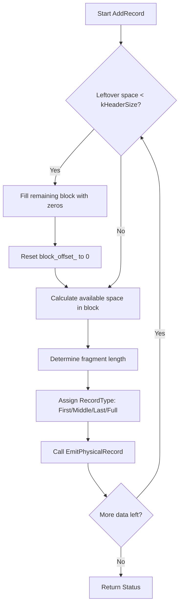

### File Overview
`db/log_writer.cc` implements the logic for writing records to the Write-Ahead Log (WAL). It acts as a wrapper around a `WritableFile`, ensuring that data is fragmented into fixed-size blocks with headers and checksums to facilitate crash recovery. It is primarily called by `DBImpl` during the write path to persist data before it is applied to the MemTable.

### Key Symbol Annotations
- `Writer` — A class that manages the fragmentation and physical writing of records to a `WritableFile`.
- `AddRecord` — The primary entry point that splits a large data slice into multiple physical records to fit within the `kBlockSize` constraint.
- `EmitPhysicalRecord` — Handles the low-level construction of the 7-byte record header (CRC, length, and type) and appends it along with the payload to the destination file.
- `InitTypeCrc` — A helper function that pre-calculates CRC values for all possible `RecordType` values to optimize the checksum calculation in `EmitPhysicalRecord`.

### Design Patterns & Engineering Practices
- **Pre-computation for Performance**: `InitTypeCrc` (lines 12-17) pre-calculates the CRC of the record type. Since `EmitPhysicalRecord` is called frequently, using a lookup table (`type_crc_`) instead of calculating the CRC of the type byte every time reduces CPU overhead.
- **Defensive Programming with `static_assert`**: The use of `static_assert(kHeaderSize == 7, "")` (line 45) ensures that the hard-coded padding string `"\x00\x00\x00\x00\x00\x00"` remains correct if the header size constant is ever changed, preventing silent corruption of the log format.
- **Fragmentation Strategy**: The logic in `AddRecord` (lines 33-71) demonstrates a robust way to handle data that exceeds a fixed buffer size. By using `RecordType` (First, Middle, Last, Full), the writer allows the reader to reconstruct a single logical record from multiple physical fragments.
- **Resource Abstraction**: The `Writer` depends on the `WritableFile` interface rather than a concrete file class, allowing LevelDB to swap the underlying storage (e.g., for testing with `memenv`).
- **Explicit State Management**: The `block_offset_` is tracked meticulously to ensure that no record header is split across two blocks, maintaining the invariant that every block contains a whole number of records or a specific padding.

### Internal Flow
The following flowchart describes how `AddRecord` processes a slice of data:

### Questions
- **Line 46**: The padding `"\x00\x00\x00\x00\x00\x00"` is 6 bytes. If `kHeaderSize` is 7, and the `leftover` is used to fill the trailer, does this imply the trailer is always exactly 6 bytes or is it just filling the gap to the next `kBlockSize` boundary?
- **Line 86**: `dest_->Flush()` is called after every single physical record. This ensures durability but might be a performance bottleneck; it is worth verifying if the `WritableFile` implementation handles buffering internally.
