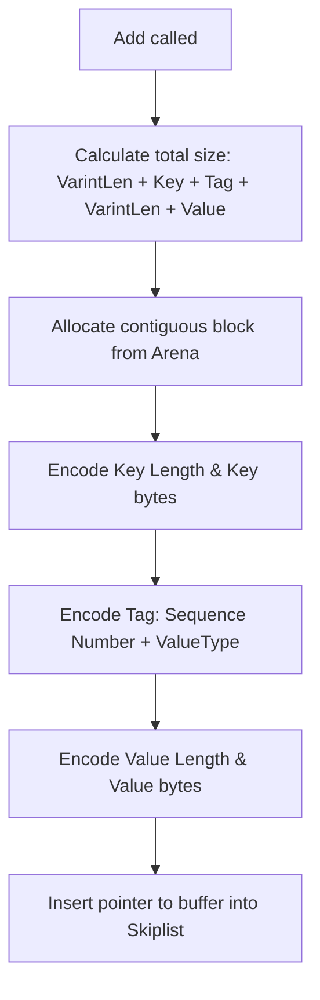

### File Overview
`db/memtable.cc` implements the in-memory sorted buffer (MemTable) that serves as the first stage of the LSM-tree write path. It manages a skiplist (via `MemTable::Table`) and an `Arena` allocator to store recent writes before they are flushed to SSTables.

### Key Symbol Annotations
- `MemTable` — The main class managing the in-memory storage, providing `Add`, `Get`, and `NewIterator` functionality.
- `MemTable::Add` — Serializes a key-value pair into a contiguous buffer and inserts it into the internal skiplist.
- `MemTable::Get` — Performs a point lookup in the MemTable, handling both values and deletion tombstones.
- `MemTableIterator` — A concrete implementation of the `Iterator` interface that allows range scanning over the MemTable.
- `GetLengthPrefixedSlice` — A helper utility to decode the length-prefixed string format used for keys and values in the MemTable.
- `MemTable::KeyComparator` — A custom comparator that allows the skiplist to sort entries based on the decoded length-prefixed internal keys.

### Design Patterns & Engineering Practices
- **Arena Allocation**: Instead of allocating every entry individually on the heap (which would cause massive fragmentation), `MemTable` uses an `Arena` (line 84). This allows for extremely fast allocation and a single bulk deallocation when the `MemTable` is destroyed.
- **Pimpl-like Internal Class**: `MemTableIterator` is defined inside the `.cc` file rather than the header. This hides the implementation details of the iterator (like the `tmp_` string and the underlying `Table::Iterator`) from the public API.
- **Manual Memory Layout**: The code uses a tight binary packing format for entries (lines 80-83). By manually calculating `encoded_len` and using `std::memcpy`, LevelDB minimizes overhead and ensures that the data is ready for sequential writing to disk during a flush.
- **Varint Encoding**: The use of `PutVarint32` and `GetVarint32Ptr` (lines 11, 52) demonstrates a commitment to space efficiency, reducing the footprint of length headers.
- **Interface Inheritance**: `MemTableIterator` inherits from the abstract `Iterator` class, allowing the rest of the system to treat MemTables and SSTables uniformly during a read (which must check both).

### Internal Flow
The following diagram illustrates the process of adding a new entry to the MemTable:

### Questions
- **Line 12**: `p = GetVarint32Ptr(p, p + 5, &len);` — The comment says "we assume 'p' is not corrupted." It would be useful to know if there is a specific reason for the `+ 5` limit (likely the maximum size of a 32-bit varint).
- **Line 116**: The `Get` method uses `key.memtable_key()`. It is worth verifying in `db/dbformat.h` how the `LookupKey` is constructed to ensure the sequence number is correctly handled during the `Seek` call.
