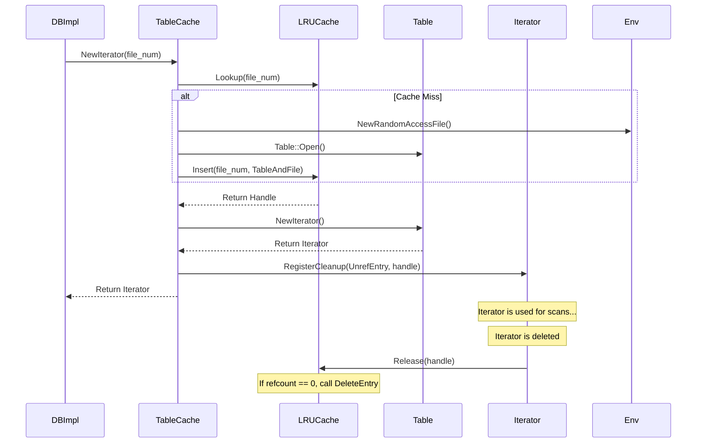

### File Overview
`db/table_cache.cc` implements a cache for open SSTable handles to avoid the overhead of repeatedly opening files and parsing table metadata. It acts as a bridge between the `DBImpl` (which requests tables) and the `Table` and `RandomAccessFile` objects, utilizing a sharded LRU cache (`util/cache.cc`) to manage memory.

### Key Symbol Annotations
- `TableAndFile` — A private helper struct that bundles a `Table` object with its underlying `RandomAccessFile` to ensure they are deleted together.
- `DeleteEntry` — A callback function used by the LRU cache to properly destroy the `TableAndFile` bundle when an entry is evicted.
- `FindTable` — The core logic that checks the cache for a table by file number; if missing, it opens the file from disk and inserts it into the cache.
- `NewIterator` — Creates a table iterator and registers a cleanup callback (`UnrefEntry`) to ensure the cache handle is released only after the iterator is destroyed.
- `Get` — Performs a point lookup in a specific SSTable, managing the cache handle lifecycle for the duration of the operation.
- `Evict` — Manually removes a specific table from the cache, typically called when a file is deleted during compaction.

### Design Patterns & Engineering Practices
- **Pimpl-like Resource Bundling**: The `TableAndFile` struct is a clean way to manage co-dependent resources. Since a `Table` cannot exist without its `RandomAccessFile`, bundling them ensures that `DeleteEntry` can clean up both without needing to track them separately.
- **Callback-based Memory Management**: The use of `DeleteEntry` as a callback passed to `cache_->Insert` is a powerful pattern for generic caches. It allows the `LRUCache` to remain agnostic of the data it stores while ensuring the `TableCache` maintains control over the destruction logic.
- **Reference Counting via Handles**: The `Cache::Handle` system prevents a "use-after-eviction" race condition. In `NewIterator`, the handle is not released immediately; instead, `result->RegisterCleanup` is used to tie the lifetime of the cache entry to the lifetime of the iterator.
- **Graceful Degradation/Fallback**: In `FindTable`, the code attempts to open a file using `TableFileName` and falls back to `SSTTableFileName`. This provides backward compatibility for files created by older versions of the software.
- **Avoidance of "Negative Caching"**: The comment in `FindTable` (lines 58-60) explicitly notes that error results are not cached. This is a critical engineering decision: caching a "File Not Found" error would prevent the system from recovering if the file was restored or a transient filesystem error occurred.

### Internal Flow
The following diagram illustrates the lifecycle of a table request, specifically highlighting how the cache handle is managed for an iterator.

### Questions
- **Line 32**: `UnrefEntry` takes `void* arg1` and `void* arg2`. While the casts reveal these are the `Cache` and `Cache::Handle`, the generic signature is required by the `Iterator` cleanup interface. It would be worth verifying if this pattern is used elsewhere for consistency.
