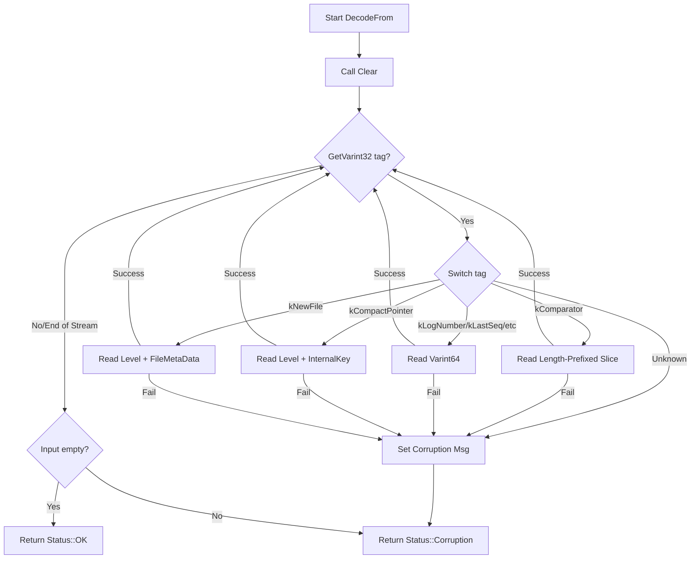

### File Overview
`db/version_edit.cc` implements the serialization and deserialization logic for `VersionEdit`, which represents an atomic change to the database's file set (the `VersionSet`). It acts as the bridge between the in-memory representation of LSM-tree metadata changes and their persistent form in the Manifest file, as evidenced by its `EncodeTo` and `DecodeFrom` methods.

### Key Symbol Annotations
- `Tag` — An internal enumeration used as markers during serialization to identify which field is being encoded/decoded.
- `VersionEdit::Clear` — Resets all fields and clears containers to make a `VersionEdit` object reusable.
- `VersionEdit::EncodeTo` — Serializes the current edit into a string using varints and length-prefixed slices for compact storage.
- `VersionEdit::DecodeFrom` — Parses a serialized string to reconstruct a `VersionEdit` object, returning a `Status::Corruption` if the data is malformed.
- `VersionEdit::DebugString` — Produces a human-readable string representation of the edit for logging and debugging.
- `GetInternalKey` — A helper function that extracts a length-prefixed slice and decodes it into an `InternalKey`.
- `GetLevel` — A helper function that reads a varint and validates that it falls within the allowed range of LSM levels.

### Design Patterns & Engineering Practices
- **Tag-Length-Value (TLV) Encoding**: The file uses a manual TLV-like pattern (via the `Tag` enum and `PutVarint32`) to ensure that the serialized format is extensible and robust. This allows the decoder to skip or identify specific fields without relying on a rigid positional schema.
- **Varint Compression**: To minimize the size of the Manifest file, the code uses `PutVarint32` and `PutVarint64` (from `util/coding.h`). This is a standard practice in high-performance storage systems to save space on small integers.
- **Defensive Decoding**: `DecodeFrom` implements strict validation. It checks for the success of every read operation (`GetVarint`, `GetLengthPrefixedSlice`) and ensures that the input is fully consumed (`!input.empty()`). If any step fails, it returns a descriptive `Status::Corruption` rather than crashing or leaving the object in an inconsistent state.
- **Pimpl-adjacent Data Handling**: While `VersionEdit` is a data-carrying class, the use of `Slice` for input and `std::string*` for output minimizes unnecessary memory allocations and copying during the serialization process.
- **Explicit State Tracking**: The use of `has_comparator_`, `has_log_number_`, etc., allows the `VersionEdit` to represent *partial* updates. Only fields that have been explicitly set are encoded, reducing the size of the Manifest.

### Internal Flow
The `DecodeFrom` method follows a state-machine-like loop to process the serialized stream:

