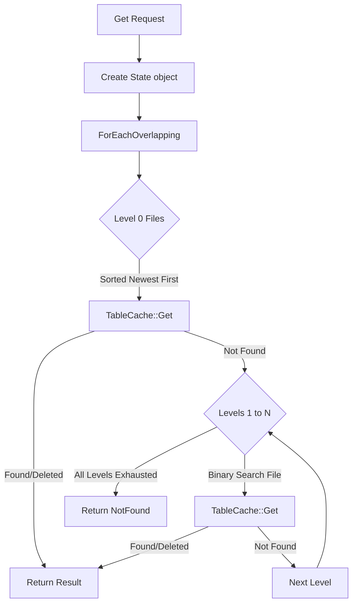
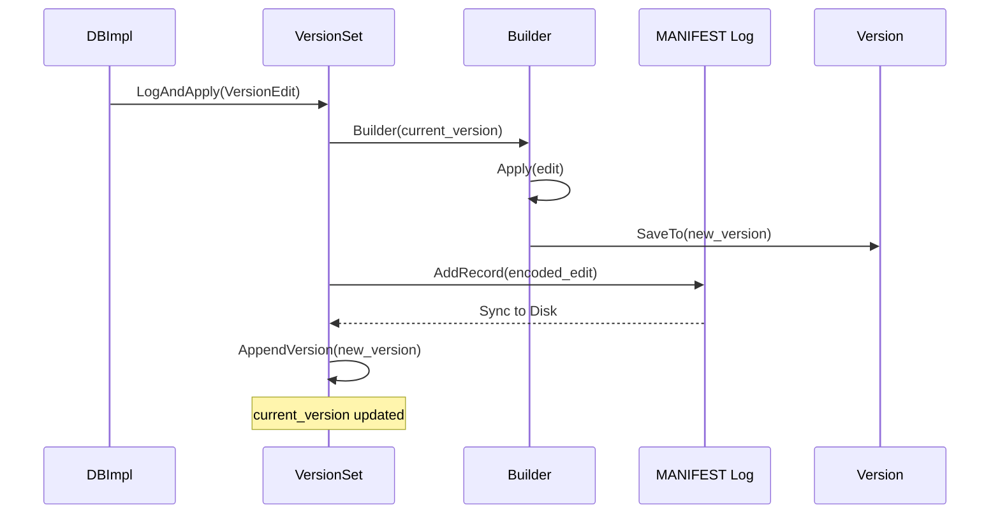

### File Overview
`db/version_set.cc` manages the metadata of the LSM-tree, specifically tracking which SSTable files are active at each level. It acts as the "source of truth" for the database state, coordinating the transition between different `Version` objects and persisting these changes via the `MANIFEST` log.

### Key Symbol Annotations
- `Version` — An immutable snapshot of the database's file organization across all levels.
- `VersionSet` — The manager that tracks the current `Version`, handles recovery from the `MANIFEST`, and applies `VersionEdit` changes.
- `VersionSet::Builder` — A helper class used to efficiently transition from one `Version` to another by applying a sequence of edits.
- `VersionEdit` — A record of changes (files added/deleted) to be applied to the `VersionSet`.
- `Version::Get` — The core read logic that searches through levels (newest first) to find the most recent value for a key.
- `Version::ForEachOverlapping` — A utility that iterates over all files in all levels that could potentially contain a specific key.
- `VersionSet::LogAndApply` — The atomic operation that persists a `VersionEdit` to the `MANIFEST` and updates the current `Version`.
- `VersionSet::Recover` — Reconstructs the `VersionSet` state by replaying the `MANIFEST` log upon database opening.
- `VersionSet::PickCompaction` — The heuristic engine that decides which level and which files should be compacted next.

### Design Patterns & Engineering Practices
- **Immutable State (Version)**: The `Version` class is immutable. Instead of modifying the current state, LevelDB creates a new `Version` object. This allows reads to continue using an old `Version` while a compaction creates a new one, avoiding complex locking during reads.
- **Pimpl-like Builder Pattern**: `VersionSet::Builder` is used to accumulate multiple changes (from a `VersionEdit`) before "freezing" them into a new `Version` via `SaveTo`. This prevents the creation of expensive intermediate `Version` objects.
- **Manual Reference Counting**: `Version` and `FileMetaData` use `Ref()` and `Unref()` (lines 71, 368) to manage shared ownership. This is a classic pre-C++11 approach to ensure a file is only deleted from disk after the last `Version` referencing it is destroyed.
- **Binary Search over Metadata**: `FindFile` (line 82) implements a binary search over the `FileMetaData` vector to quickly locate which SSTable might contain a key, reducing the search space from $O(N)$ to $O(\log N)$ files per level.
- **Custom Iterators**: `LevelFileNumIterator` (line 157) wraps a vector of metadata to provide a standard `Iterator` interface, allowing the `TwoLevelIterator` to lazily open files only when needed.

### Internal Flow

#### Read Path (Version::Get)

#### Version Update (LogAndApply)

### Questions
- **Line 418**: The logic for `f->allowed_seeks` calculation (dividing file size by 16KB) is a heuristic. It would be useful to understand if this constant is tuned for specific hardware (e.g., HDD vs SSD).
- **Line 562**: In `Recover`, the `builder` is initialized with `current_`, but `current_` is not yet fully established during the recovery process. The initialization of `dummy_versions_` and the first `Version` in the constructor vs. `Recover` needs careful tracing.
