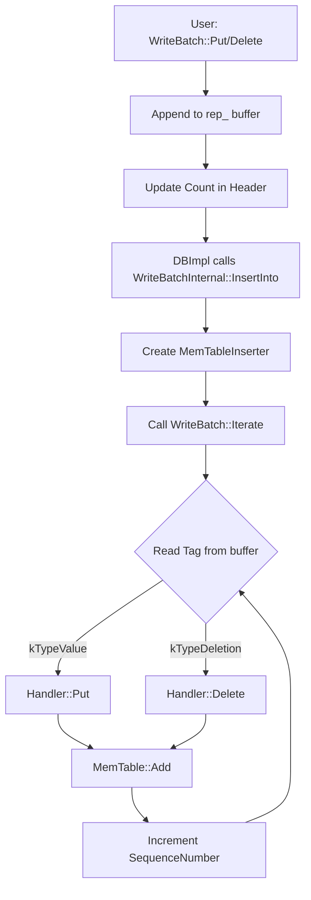

### File Overview
`db/write_batch.cc` implements the `WriteBatch` class, which allows users to group multiple `Put` and `Delete` operations into a single atomic unit. It acts as a serialized buffer of operations that are later applied to the `MemTable` via `WriteBatchInternal::InsertInto`.

### Key Symbol Annotations
- `WriteBatch` — A container that serializes a sequence of updates into a compact byte array (`rep_`).
- `WriteBatch::Iterate` — Deserializes the internal byte array and executes each operation using a provided `Handler`.
- `WriteBatch::Handler` — An abstract interface (Visitor pattern) used to process the operations contained within a batch.
- `WriteBatchInternal` — A set of helper functions that provide privileged access to the `WriteBatch` internal representation (e.g., setting sequence numbers).
- `MemTableInserter` — A private implementation of `Handler` that applies a batch's operations directly into a `MemTable`.
- `WriteBatchInternal::InsertInto` — The bridge that takes a serialized batch and applies it to the in-memory storage.

### Design Patterns & Engineering Practices
- **The Visitor Pattern**: The `Handler` class and `Iterate` method implement a classic Visitor pattern. Instead of `WriteBatch` knowing how to "apply" itself to different targets (MemTable, Log, etc.), it accepts a `Handler` that defines the action for each operation type.
- **Compact Binary Serialization**: Rather than storing a `std::vector` of objects (which would incur overhead and pointer indirection), LevelDB uses a single `std::string rep_` as a contiguous byte buffer. It uses `varint` encoding (via `PutLengthPrefixedSlice`) to minimize space, which is critical for high-throughput write paths.
- **Pimpl-like Internal Access**: The use of `WriteBatchInternal` separates the public API (what the user can do) from the internal management (what the database engine needs to do, like setting the `SequenceNumber`). This keeps the public `WriteBatch` interface clean.
- **Efficient Memory Management**: `WriteBatch::Clear()` uses `resize(kHeader)` rather than reallocating a new string, allowing the underlying buffer to be reused across multiple batches.
- **Strong Invariant Checking**: In `Iterate`, the code verifies that the number of records actually processed matches the `count` stored in the header, providing a basic integrity check against corruption.

### Internal Flow
The following diagram illustrates how a `WriteBatch` is constructed and eventually applied to the database's memory storage.

### Questions
- **Line 56**: The `found` counter is used to verify the `Count` at the end of `Iterate`. It is worth confirming if this check is intended to catch partial writes or if it's primarily for detecting memory corruption during deserialization.
