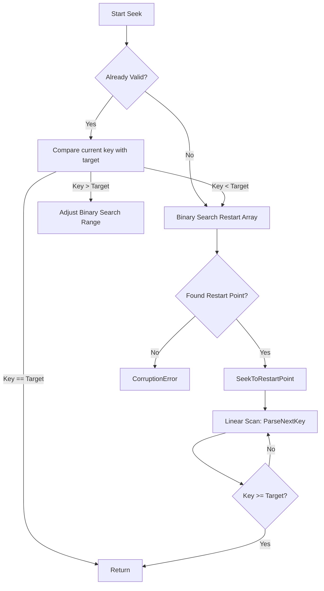

### File Overview
`table/block.cc` implements the decoding logic for data blocks within an SSTable. It provides a specialized `Iterator` that can efficiently navigate compressed key-value pairs using a "restart point" index, allowing for binary search within a block. It is called by `table/table.cc` to provide access to the actual data stored on disk.

### Key Symbol Annotations
- `Block` — Represents a decoded chunk of an SSTable, managing the raw data buffer and calculating the offset of the restart index.
- `Block::Iter` — A concrete implementation of the `Iterator` interface for scanning and seeking keys within a single block.
- `DecodeEntry` — A helper function that parses the prefix-compressed format (shared length, non-shared length, and value length) of a single entry.
- `Block::Iter::Seek` — Performs a binary search over the restart points followed by a linear scan to find the first key $\ge$ target.
- `Block::Iter::ParseNextKey` — The core state-machine logic that advances the iterator to the next entry and updates the current restart index.
- `Block::NewIterator` — Factory method that validates the block's integrity and returns a usable iterator.

### Design Patterns & Engineering Practices
- **Prefix Compression**: The file implements a highly efficient storage format where keys share a common prefix with the previous entry. `DecodeEntry` handles this by reading `shared` and `non_shared` lengths, reducing disk I/O and memory footprint.
- **Restart Points for Binary Search**: Since entries are variable-length, you cannot binary search them directly. LevelDB stores "restart points" (fixed-size offsets) at the end of the block. `Block::Iter::Seek` uses these to jump to a known position and then scans linearly, balancing search speed with storage overhead.
- **Pimpl-like Resource Management**: The `Block` class uses a `BlockContents` struct to initialize data. The `owned_` boolean flag (lines 34-38) ensures that the `Block` destructor only deletes the `data_` buffer if it was heap-allocated, allowing the class to wrap both owned and borrowed memory.
- **Fast-Path Optimization**: In `DecodeEntry` (lines 62-65), there is a "fast path" check: if the shared, non-shared, and value lengths are all $< 128$, they are read as single bytes rather than calling the more expensive `GetVarint32Ptr`.
- **Iterator State Management**: The `Block::Iter` maintains its position using `current_` (an offset) rather than a pointer, and tracks its `restart_index_` to optimize `Prev()` and `Seek()` operations.

### Internal Flow
The following flowchart describes the logic used by `Block::Iter::Seek` to find a specific key:

### Questions
- **Line 176**: In `ParseNextKey`, the condition `key_.size() < shared` is used to detect corruption. It is implied that `key_` contains the prefix from the previous entry, but the explicit mechanism of how `key_` is seeded for the very first entry in a block (where `shared` should be 0) is implicit in `SeekToRestartPoint` calling `key_.clear()`.
