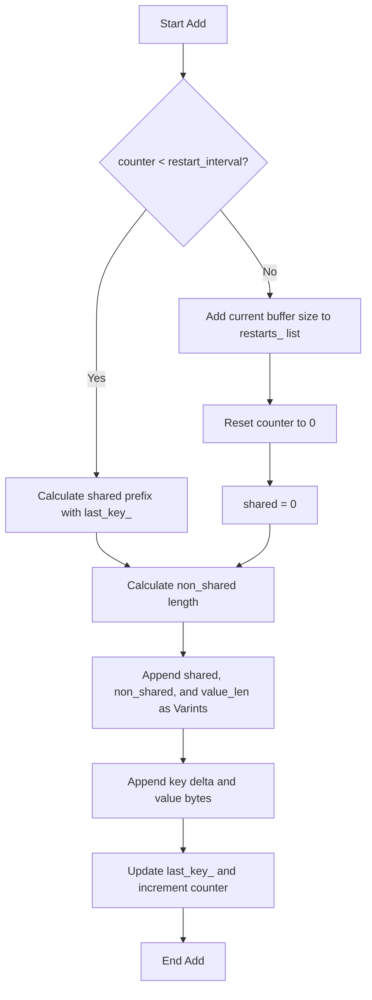

### File Overview
`table/block_builder.cc` implements the logic for constructing a single data block within an SSTable. It is used by `TableBuilder` to compress keys via prefix-sharing and to create the restart-point index used for binary search during reads.

### Key Symbol Annotations
- `BlockBuilder` — A helper class that buffers key-value pairs and encodes them into a compressed binary format.
- `Add` — Appends a key-value pair to the block, applying prefix compression relative to the previous key unless a restart point is triggered.
- `Finish` — Finalizes the block by appending the restart point offsets and the total count of restarts to the buffer.
- `Reset` — Clears the internal buffer and state to allow the `BlockBuilder` instance to be reused for a new block.
- `CurrentSizeEstimate` — Calculates the total bytes the block will occupy once `Finish()` is called.

### Design Patterns & Engineering Practices
- **Prefix Compression**: The implementation reduces disk space by only storing the "delta" (non-shared suffix) between consecutive keys. This is a classic LSM-tree optimization for sorted data.
- **Restart Points**: To avoid scanning the entire block linearly to decode prefix compression, the code inserts "restart points" every $K$ keys (defined by `options_->block_restart_interval`). This allows the reader to perform a binary search over the restart points and then a short linear scan.
- **Varint Encoding**: The use of `PutVarint32` (from `util/coding.h`) ensures that small integers (like shared byte counts or short string lengths) occupy fewer bytes, further optimizing space.
- **Pimpl-like Buffer Management**: The use of a `std::string buffer_` as a byte array is a common C++ idiom for building binary blobs before writing them to a file or returning them as a `Slice`.
- **Defensive Programming**: Extensive use of `assert()` (e.g., lines 76-80) ensures that keys are added in strictly increasing order and that the builder is not used after `Finish()` has been called.

### Internal Flow
The following flowchart describes the logic within the `Add` method:

### Questions
- **Line 81**: `if (counter_ < options_->block_restart_interval)` — If the interval is 10, the 10th key (index 9) will be compressed, and the 11th key (index 10) will trigger the restart. It would be useful to verify if the "restart" occurs *on* the $K$-th key or *after* the $K$-th key.
