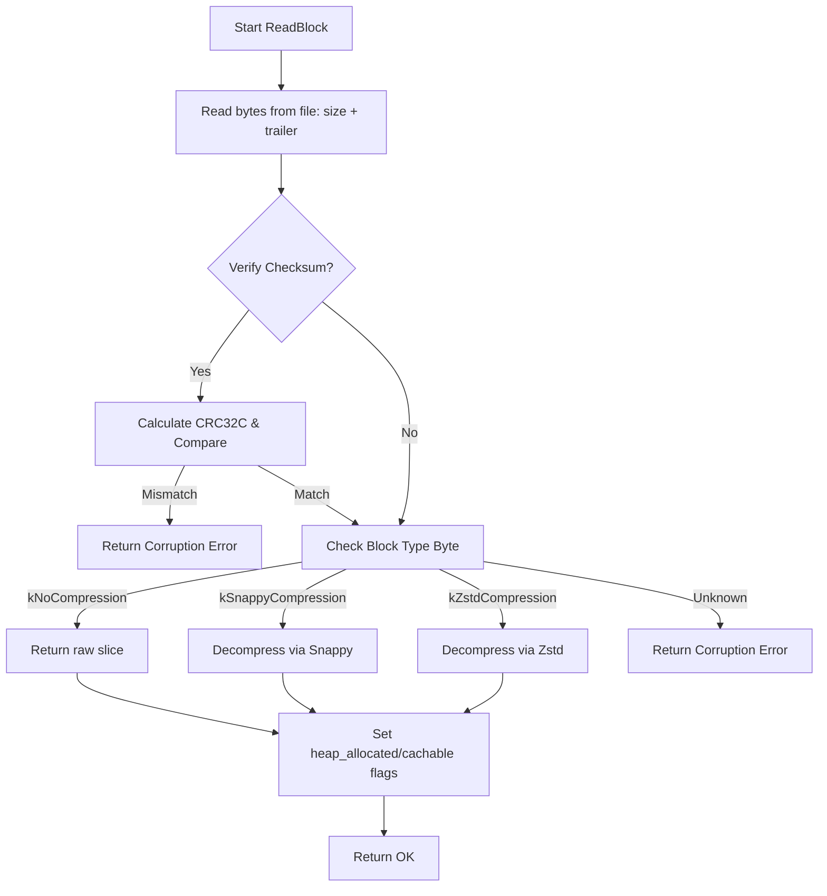

### File Overview
`table/format.cc` implements the on-disk serialization and deserialization logic for SSTable components. It provides the low-level encoding for `BlockHandle` and `Footer` structures and handles the physical reading and decompression of data blocks from disk, as evidenced by its calls from `Table` and `TableBuilder`.

### Key Symbol Annotations
- `BlockHandle::EncodeTo` — Serializes a block's offset and size into a string using variable-length integers.
- `BlockHandle::DecodeFrom` — Deserializes a block's offset and size from a byte slice.
- `Footer::EncodeTo` — Writes the SSTable footer, including handles to the index and metaindex, followed by a magic number for file validation.
- `Footer::DecodeFrom` — Validates the SSTable magic number and extracts the index and metaindex handles from the end of the file.
- `ReadBlock` — Reads a raw block from a `RandomAccessFile`, verifies its CRC checksum, and handles decompression (Snappy/Zstd) based on the block type.

### Design Patterns & Engineering Practices
- **Variable-Length Encoding**: The use of `PutVarint64` and `GetVarint64` in `BlockHandle` demonstrates a space-optimization technique to store large integers (offsets/sizes) using only as many bytes as necessary.
- **Magic Number Validation**: `Footer::DecodeFrom` implements a "magic number" check at the end of the file. This is a standard practice to quickly verify that a file is indeed a LevelDB SSTable before attempting to parse it.
- **Manual Memory Management for Buffers**: In `ReadBlock`, the code uses `new char[]` and `delete[]` rather than `std::vector`. This is likely for performance and to allow the `BlockContents` struct to track `heap_allocated` status, enabling the caller to decide how to free the memory or whether to cache it.
- **Defensive Programming**: The use of `assert` in `EncodeTo` functions ensures that internal invariants (like fields being initialized) are met during development, while `Status::Corruption` is used for runtime error handling of malformed disk data.
- **Explicit Casting**: The use of `static_cast<uint64_t>(0)` and `0xffffffffu` shows a disciplined approach to avoiding signed/unsigned comparison warnings and ensuring bitwise operations are performed on unsigned types.

### Internal Flow
The `ReadBlock` function follows a strict pipeline to transform raw disk bytes into usable data:

### Questions
- **Line 106**: The comment `// File implementation gave us pointer to some other data` suggests that some `RandomAccessFile` implementations might return a pointer to an internal buffer (like a memory-mapped file) rather than the provided `buf`. It would be useful to identify which `Env` implementations trigger this path.
