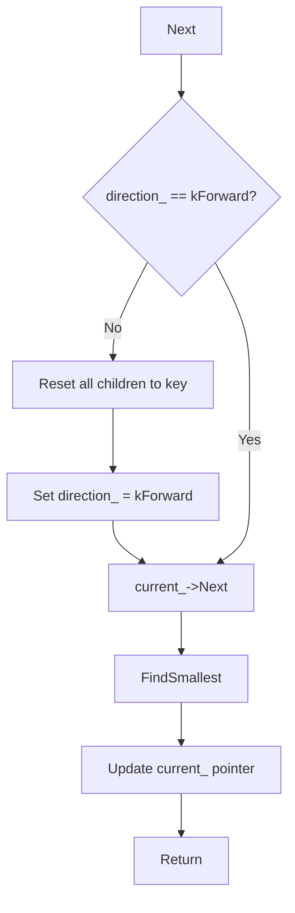

### File Overview
`table/merger.cc` implements a `MergingIterator` that merges multiple sorted iterators into a single sorted view. It is used by `DBImpl` and `VersionSet` to provide a unified read interface across multiple SSTables and MemTables, effectively implementing the "merge" part of the LSM-tree read path.

### Key Symbol Annotations
- `NewMergingIterator` — A factory function that returns an optimized iterator: an empty iterator if $n=0$, a direct pointer if $n=1$, or a new `MergingIterator` for $n > 1$.
- `MergingIterator` — A private implementation of the `Iterator` interface that coordinates multiple child iterators to present a single sorted sequence.
- `MergingIterator::Seek` — Positions all child iterators to the target key and identifies the smallest available key across all children.
- `MergingIterator::Next` / `Prev` — Advances or retreats the merged view by moving the `current_` child iterator and re-evaluating the smallest/largest key.
- `MergingIterator::FindSmallest` / `FindLargest` — Helper methods that perform a linear scan across all child iterators to find the current global minimum or maximum key.

### Design Patterns & Engineering Practices
- **Pimpl-like Factory Pattern**: The `MergingIterator` class is defined in an anonymous namespace, hiding the implementation details from the header. The public interface is provided via the `NewMergingIterator` factory function.
- **Optimization for Common Cases**: `NewMergingIterator` avoids the overhead of creating a `MergingIterator` object when $n=0$ or $n=1$, returning the child iterator directly if only one exists.
- **RAII and Resource Management**: The `MergingIterator` uses a dynamically allocated array of `IteratorWrapper` objects (`children_`) and ensures they are cleaned up in the destructor (`~MergingIterator`).
- **State-Based Directionality**: The `direction_` enum (`kForward`, `kReverse`) is used to avoid redundant `Seek` operations. If the iterator is already moving in the requested direction, it assumes the children are already correctly positioned relative to the current key.
- **Interface Inheritance**: By inheriting from `Iterator`, `MergingIterator` can be used polymorphically anywhere a standard LevelDB iterator is expected, allowing the caller to be agnostic about whether they are reading from one table or ten.

### Internal Flow
The following flowchart describes the logic when calling `Next()` on a `MergingIterator`:

### Questions
- **Linear Scan Complexity**: In `FindSmallest` and `FindLargest`, the code performs a linear scan $O(n)$. The comment on line 128 mentions using a heap for many children; it would be interesting to know at what value of $n$ the overhead of a priority queue becomes lower than a linear scan in LevelDB's typical workload.
