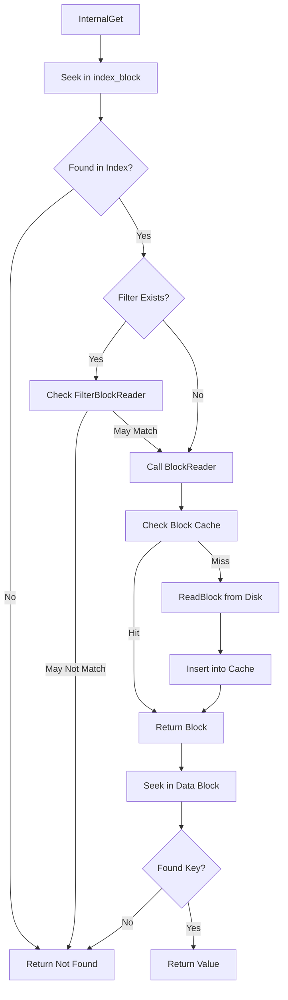

### File Overview
`table/table.cc` implements the `Table` class, which represents a single SSTable (Sorted String Table) on disk. It serves as the bridge between the raw file bytes (via `RandomAccessFile`) and the high-level iterator interface, coordinating the use of the index block, filter blocks, and the block cache.

### Key Symbol Annotations
- `Table::Rep` — A private implementation structure (Pimpl idiom) that holds the table's state, including the file handle, index block, and filter.
- `Table::Open` — Initializes a `Table` object by reading the footer from the end of the file and loading the index block into memory.
- `Table::ReadMeta` — Reads the metaindex block to locate and initialize the Bloom filter if a filter policy is configured.
- `Table::ReadFilter` — Decodes the filter handle and initializes the `FilterBlockReader` to allow fast membership checks.
- `Table::BlockReader` — A callback function used by the two-level iterator to lazily load data blocks from disk or the `block_cache`.
- `Table::NewIterator` — Creates a `TwoLevelIterator` that first searches the index block and then uses `BlockReader` to search the resulting data block.
- `Table::InternalGet` — Performs a point lookup for a key, utilizing the Bloom filter to potentially skip reading the data block entirely.
- `Table::ApproximateOffsetOf` — Estimates the byte offset of a key in the file, primarily used for range-based optimizations.

### Design Patterns & Engineering Practices
- **Pimpl Idiom (`Table::Rep`)**: The use of a `Rep` struct hides internal implementation details from the public `Table` header, reducing compilation dependencies and keeping the public API clean.
- **Lazy Loading & Two-Level Iteration**: Instead of loading the entire SSTable into memory, `NewIterator` creates a hierarchy. The first level iterates over the `index_block` (which is always in memory), and the second level (`BlockReader`) loads data blocks only when needed.
- **Manual Reference Counting/Cleanup**: The use of `RegisterCleanup` in `BlockReader` (lines 167-171) demonstrates a pattern for managing the lifetime of blocks. If a block is from the cache, it releases a cache handle; if it's a fresh allocation, it deletes the block.
- **Cache Key Composition**: In `BlockReader` (lines 138-141), a unique cache key is generated by combining the `cache_id` (unique per table) and the block's `offset`. This prevents collisions between different SSTables that might have blocks at the same offset.
- **RAII and Memory Management**: The `Table::Rep` destructor (lines 20-24) ensures that all heap-allocated components (filter, filter data, index block) are cleaned up when the table is closed.

### Internal Flow
The following diagram illustrates the process of retrieving a value via `InternalGet`:

### Questions
- **Line 87**: The comment `// TODO(sanjay): Skip this if footer.metaindex_handle() size indicates...` suggests a potential optimization that was never implemented; it would be interesting to see if this causes overhead for tables without filters.
- **Line 118**: In `ReadFilter`, the code assigns `rep_->filter_data = block.data.data()` if `heap_allocated` is true. It's important to verify that `block.data` (a `std::string`) doesn't go out of scope or get modified, as `filter_data` is a raw pointer.
