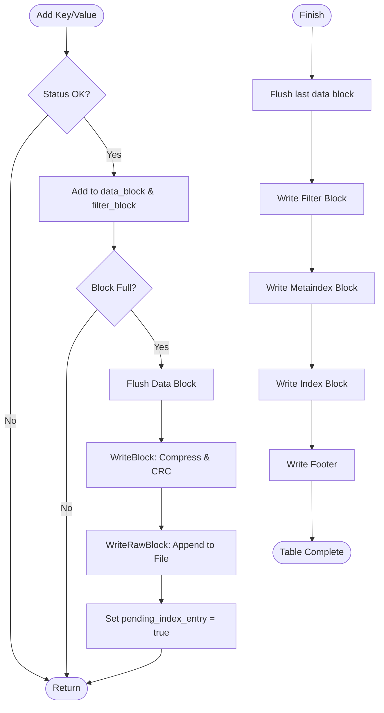

### File Overview
`table/table_builder.cc` implements the logic for constructing an SSTable (Sorted String Table) on disk. It acts as the bridge between in-memory data (provided via `Add`) and the final on-disk format, coordinating the creation of data blocks, the index block, the filter block, and the footer.

### Key Symbol Annotations
- `TableBuilder::Rep` — A private implementation structure (Pimpl) that holds the state of the table construction, including block builders and file offsets.
- `TableBuilder::Add` — Inserts a key-value pair into the current data block and triggers a `Flush` if the block size limit is reached.
- `TableBuilder::Flush` — Finalizes the current data block and writes it to the `WritableFile`.
- `TableBuilder::WriteBlock` — Handles the compression logic (Snappy/Zstd) and calls `WriteRawBlock` to commit data to disk.
- `TableBuilder::WriteRawBlock` — Appends the actual bytes to the file and attaches the required trailer (compression type and CRC32C checksum).
- `TableBuilder::Finish` — The finalization step that writes the filter block, metaindex, index block, and the footer to complete the SSTable.
- `TableBuilder::Abandon` — Marks the builder as closed without finalizing, used when a table is no longer needed (e.g., during a failed compaction).

### Design Patterns & Engineering Practices
- **Pimpl Idiom (Pointer to Implementation)**: The use of `TableBuilder::Rep` (lines 17-54) hides the internal state and dependencies (like `BlockBuilder` and `FilterBlockBuilder`) from the public header. This reduces compilation dependencies and keeps the public API clean.
- **Deferred Indexing**: A sophisticated optimization is used for the index block (lines 43-48). Instead of indexing the first key of a block immediately, the builder waits until the first key of the *next* block is seen. This allows the use of `FindShortestSeparator` (line 86), which minimizes the size of keys stored in the index.
- **RAII and Resource Management**: The `TableBuilder` destructor (lines 65-69) ensures that the `Rep` and `filter_block` are deleted, and uses an `assert(rep_->closed)` to enforce the contract that the caller must explicitly call `Finish()` or `Abandon()`.
- **Efficient Buffer Reuse**: The `compressed_output` string (line 53) is a member of the `Rep` struct and is cleared but not reallocated between blocks (line 147), reducing the number of dynamic memory allocations during the write process.
- **Error Propagation**: The `status` field in `Rep` is used to track the first failure that occurs during the building process. Subsequent calls check `ok()` (which checks `rep_->status`) to avoid performing further operations after a failure.

### Internal Flow
The following diagram illustrates the lifecycle of adding data and finalizing the table:

### Questions
- **Line 86**: `r->options.comparator->FindShortestSeparator(&r->last_key, key);` — The logic for calculating the "shortest separator" is critical for index size; it would be useful to examine the `Comparator` implementation to see how it determines the minimal string that separates two keys.
