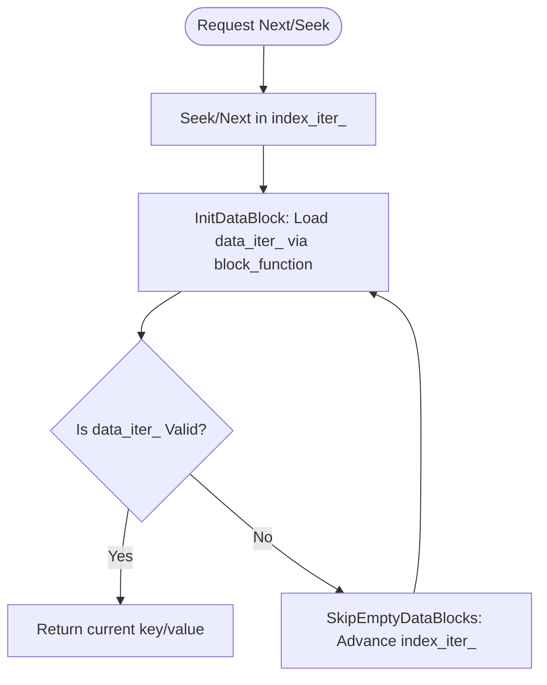

### File Overview
This file implements the `TwoLevelIterator`, a specialized iterator that provides a seamless view over a hierarchical data structure (an index iterator and a data block iterator). It is primarily used by `Table` and `VersionSet` to iterate over SSTable data by using an index to locate and load the appropriate data blocks.

### Key Symbol Annotations
- `TwoLevelIterator` — A class that wraps an `index_iter_` to find data blocks and a `data_iter_` to iterate through the actual key-value pairs within those blocks.
- `NewTwoLevelIterator` — A factory function that instantiates a `TwoLevelIterator` on the heap.
- `InitDataBlock` — Resolves the current index entry into a concrete data block iterator using the provided `block_function_`.
- `SkipEmptyDataBlocksForward/Backward` — Helper methods that advance or retreat the index iterator when the current data block is exhausted or empty.
- `IteratorWrapper` — A utility (from `iterator_wrapper.h`) used to manage the lifecycle and ownership of the underlying `Iterator` pointers.

### Design Patterns & Engineering Practices
- **The Bridge/Wrapper Pattern**: The `TwoLevelIterator` acts as a coordinator between two different levels of iteration. It abstracts the complexity of "block hopping" from the user, making the SSTable appear as a single contiguous sorted list of keys.
- **Function Pointer as a Factory**: The use of `BlockFunction` (a typedef for a function pointer) allows `TwoLevelIterator` to remain agnostic of how a block is actually read from disk or cache. It simply calls the function with a `handle` to get an iterator.
- **Resource Management via `IteratorWrapper`**: Instead of raw pointers, the class uses `IteratorWrapper` for `index_iter_` and `data_iter_`. This ensures that when the `TwoLevelIterator` is destroyed or when a block is swapped, the previous iterator is properly deleted (RAII).
- **Lazy Loading/Caching**: In `InitDataBlock`, the code checks if the `handle` of the current index entry matches `data_block_handle_`. This prevents the expensive overhead of recreating a data iterator if the index has moved but is still pointing to the same physical block.
- **Error Propagation**: The `status()` method implements a priority-based error reporting system, checking the index iterator first, then the data iterator, and finally the internal `status_` member.

### Internal Flow
The following flowchart describes how `TwoLevelIterator` handles movement (like `Next()` or `Seek()`) to ensure it always lands on a valid key.

### Questions
- **Line 108**: `data_block_handle_.assign(handle.data(), handle.size());` — Since `handle` is a `Slice` (which is just a pointer and length), is there any risk of the underlying memory being reclaimed before `data_block_handle_` is used, or is the handle guaranteed to be stable for the duration of the block's life?
