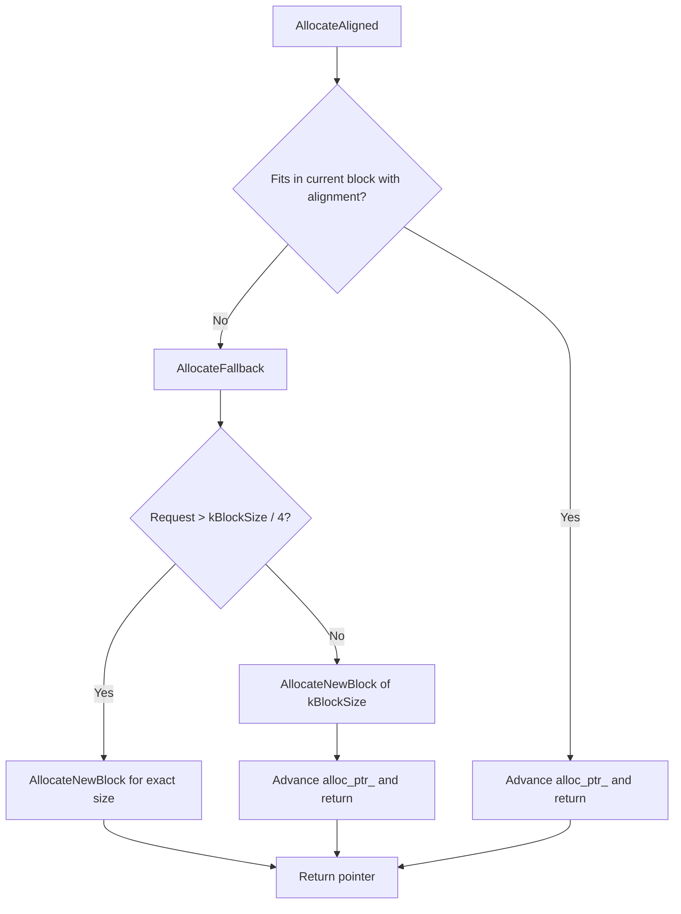

### File Overview
`util/arena.cc` implements a region-based memory allocator designed to reduce the overhead of frequent small allocations. It sits in the `util/` directory as a foundational primitive, providing fast, contiguous memory blocks that are reclaimed all at once when the `Arena` is destroyed.

### Key Symbol Annotations
- `Arena::~Arena` — Iterates through the `blocks_` vector to delete all allocated memory chunks, ensuring no leaks.
- `AllocateAligned` — Ensures the returned pointer satisfies alignment requirements (typically 8 bytes) by calculating and skipping "slop" bytes.
- `AllocateFallback` — Handles cases where the current block is exhausted or the requested size is too large to fit efficiently.
- `AllocateNewBlock` — Performs the actual heap allocation via `new char[]` and tracks the pointer and total memory usage.

### Design Patterns & Engineering Practices
- **Region-Based Allocation (Arena)**: Instead of calling `malloc`/`new` for every small object, the `Arena` allocates large chunks (`kBlockSize`) and carves them up. This minimizes heap fragmentation and makes deallocation $O(1)$ relative to the number of blocks rather than $O(N)$ relative to the number of objects.
- **Alignment Handling**: In `AllocateAligned`, the code manually calculates the padding (`slop`) required to align the pointer to the machine's word size. This is critical for performance and avoiding crashes on architectures that forbid unaligned access.
- **Pimpl-like Resource Management**: The `Arena` owns all memory it allocates. By storing pointers in `blocks_` and deleting them in the destructor, it implements a strict ownership model where the lifetime of all allocated objects is tied to the lifetime of the `Arena` instance.
- **Atomic Accounting**: `memory_usage_` uses `fetch_add` with `std::memory_order_relaxed`. This allows the system to track total memory consumption across threads without the heavy overhead of a full mutex, as strict synchronization isn't required for a telemetry counter.
- **Waste Mitigation**: In `AllocateFallback`, there is a heuristic: if a request is larger than $1/4$ of a block, it is allocated as its own dedicated block. This prevents a single large allocation from wasting nearly an entire $4\text{KB}$ block.

### Internal Flow
The logic for requesting memory follows this decision tree:

