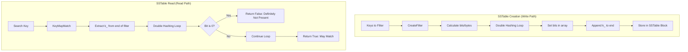

### File Overview
This file implements a Bloom filter policy used by LevelDB to reduce disk I/O by quickly determining if a key *might* exist in an SSTable. It provides a concrete implementation of the `FilterPolicy` interface, which is instantiated via the factory function `NewBloomFilterPolicy` and used during SSTable creation and reading.

### Key Symbol Annotations
- `BloomFilterPolicy` — An internal class that implements the `FilterPolicy` interface to manage the creation and querying of Bloom filters.
- `BloomHash` — A helper function that computes a 32-bit hash of a `Slice` using a specific seed.
- `CreateFilter` — Generates a bit-array (stored in a string) representing a set of keys, appending the number of hash probes (`k_`) to the end for persistence.
- `KeyMayMatch` — Checks if a given key is potentially present in the filter; returns `false` if the key is definitely not present.
- `NewBloomFilterPolicy` — A public factory function that returns a heap-allocated `BloomFilterPolicy` instance.

### Design Patterns & Engineering Practices
- **Pimpl-like Encapsulation via Anonymous Namespace**: The `BloomFilterPolicy` class is defined within an anonymous namespace (lines 13-83). This hides the implementation details from other translation units, exposing only the `NewBloomFilterPolicy` factory function.
- **Interface-Based Design**: By inheriting from `FilterPolicy`, LevelDB allows the database to remain agnostic of the specific filter algorithm used, enabling different policies to be swapped in without changing the core `DBImpl` logic.
- **Double Hashing Optimization**: Instead of computing $k$ independent hashes (which is expensive), the code uses a technique from Kirsch and Mitzenmacher (lines 44-48) where two hash values (the original `h` and a rotated `delta`) are used to simulate multiple hash functions: $g_i(x) = h_1(x) + i \cdot h_2(x)$.
- **Self-Describing Data**: The filter stores its own configuration (the number of probes `k_`) as the last byte of the filter string (line 41). This ensures that `KeyMayMatch` can correctly decode filters even if the `bits_per_key` setting was changed between the time the SSTable was written and when it is read (line 63).
- **Memory Efficiency**: The use of `std::string` as a buffer for the bit-array allows the filter to be easily integrated into LevelDB's existing block-based storage system.

### Internal Flow
The following diagram illustrates the lifecycle of a Bloom filter from creation during SSTable flushing to its use during a read operation.

### Questions
- **Line 64-68**: The comment mentions that `k > 30` is reserved for "potentially new encodings for short bloom filters." It is unclear if there were specific alternative algorithms considered or if this is simply a forward-compatibility guard.
