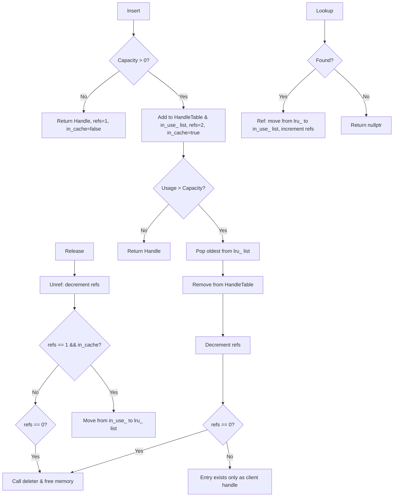

### File Overview
`util/cache.cc` implements a sharded LRU (Least Recently Used) cache used by LevelDB to store decoded data blocks and table handles. It sits in the `util/` directory as a general-purpose utility, called by `DBImpl` and `TableCache` to reduce disk I/O by keeping frequently accessed data in memory.

### Key Symbol Annotations
- `LRUHandle` — The internal representation of a cache entry, containing the value, key, reference count, and pointers for both the hash table and the LRU linked lists.
- `HandleTable` — A custom-built hash table that maps keys to `LRUHandle` pointers, optimized for minimal overhead and fast lookups.
- `LRUCache` — A single shard of the cache that manages the LRU eviction logic and the `HandleTable`.
- `ShardedLRUCache` — The public `Cache` implementation that distributes keys across multiple `LRUCache` shards to reduce mutex contention.
- `NewLRUCache` — The factory function used to instantiate a `ShardedLRUCache`.

### Design Patterns & Engineering Practices
- **Sharding for Concurrency**: Instead of a single global lock, `ShardedLRUCache` uses `kNumShards` (16) separate `LRUCache` instances. This allows concurrent access to different shards, significantly reducing lock contention in multi-threaded environments.
- **Pimpl-like Interface**: The public `Cache` class is an abstract interface, and the concrete `ShardedLRUCache` is hidden in an anonymous namespace, encapsulating the implementation details.
- **Manual Memory Management for Performance**: 
    - `LRUHandle` uses a "flexible array member" pattern (`char key_data[1]`) and `malloc` (line 213) to allocate the handle and the variable-length key in a single contiguous memory block, reducing heap fragmentation and improving cache locality.
    - It uses a custom `HandleTable` instead of `std::unordered_map` to avoid the overhead of standard library containers and ensure predictable performance.
- **Reference Counting**: The cache employs a manual reference counting system (`refs` field in `LRUHandle`). An item is only truly deleted when its reference count reaches zero, ensuring that clients holding a `Handle` can safely access the value even if the cache evicts the entry.
- **LRU List Management**: The use of two dummy heads (`lru_` and `in_use_`) for circular doubly linked lists simplifies the logic for adding and removing elements by eliminating null-pointer checks for head/tail boundaries.

### Internal Flow
The following diagram illustrates the lifecycle of a cache entry from insertion to eviction/deletion.

### Questions
- **Line 47**: The `TODO(opt): Only allow uint32_t?` regarding `charge` suggests a potential optimization to reduce the size of `LRUHandle` on 64-bit systems.
- **Line 226**: The logic `if (capacity_ > 0)` handles the case where caching is disabled. It is worth verifying if `capacity_ == 0` is a common configuration or primarily for testing.
