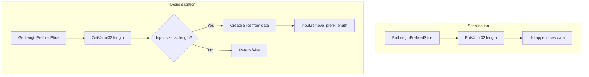

### File Overview
`util/coding.cc` provides low-level serialization primitives for converting integers and slices into byte streams and vice versa. It serves as a foundational utility used throughout the project—specifically by `db/dbformat.h`, `table/block_builder.h`, and `db/version_edit.cc`—to ensure efficient on-disk storage and compact representation of metadata.

### Key Symbol Annotations
- `PutFixed32` / `PutFixed64` — Appends a fixed-width integer to a string in a platform-independent way.
- `EncodeVarint32` / `EncodeVarint64` — Encodes an integer using a variable-length format (Base-128) into a raw buffer.
- `PutVarint32` / `PutVarint64` — High-level wrappers that use a stack buffer to append a variable-length integer to a `std::string`.
- `GetVarint32` / `GetVarint64` — Decodes a variable-length integer from a `Slice` and advances the slice pointer.
- `PutLengthPrefixedSlice` — Serializes a `Slice` by first writing its length as a varint, followed by the raw data.
- `GetLengthPrefixedSlice` — Deserializes a `Slice` by reading the varint length and extracting the corresponding number of bytes.
- `VarintLength` — Calculates how many bytes are required to encode a given 64-bit integer.

### Design Patterns & Engineering Practices
- **Varint Encoding (Base-128)**: The file implements a common optimization where the most significant bit (MSB) of each byte acts as a "continuation bit." This significantly reduces the space required for small integers, which are frequent in LSM-tree metadata (e.g., sequence numbers, lengths).
- **Avoidance of Heap Allocation**: In `PutVarint32` and `PutVarint64`, the code uses small fixed-size stack buffers (`char buf[5]` and `char buf[10]`) to perform the encoding before appending to the `std::string`. This avoids multiple small reallocations or calls to `std::string::push_back`.
- **Pointer Arithmetic and Casting**: The code demonstrates careful use of `reinterpret_cast<uint8_t*>` when performing bitwise operations on `char*` buffers. This is critical because `char` can be signed or unsigned depending on the platform, and bit-shifting signed integers can lead to undefined behavior or incorrect results.
- **Slice-based API**: The `Get*` functions take a `Slice* input` and modify it in place (updating the pointer and size). This "consuming" pattern allows for efficient sequential parsing of a byte stream without copying data.
- **Branch Optimization**: In `EncodeVarint32`, the code uses an `if/else if` chain based on the value's magnitude rather than a `while` loop. This is a performance optimization to reduce loop overhead for the most common small-integer cases.

### Internal Flow
The following flow describes the process of serializing and then deserializing a length-prefixed string (a common pattern for keys and values in LevelDB).

