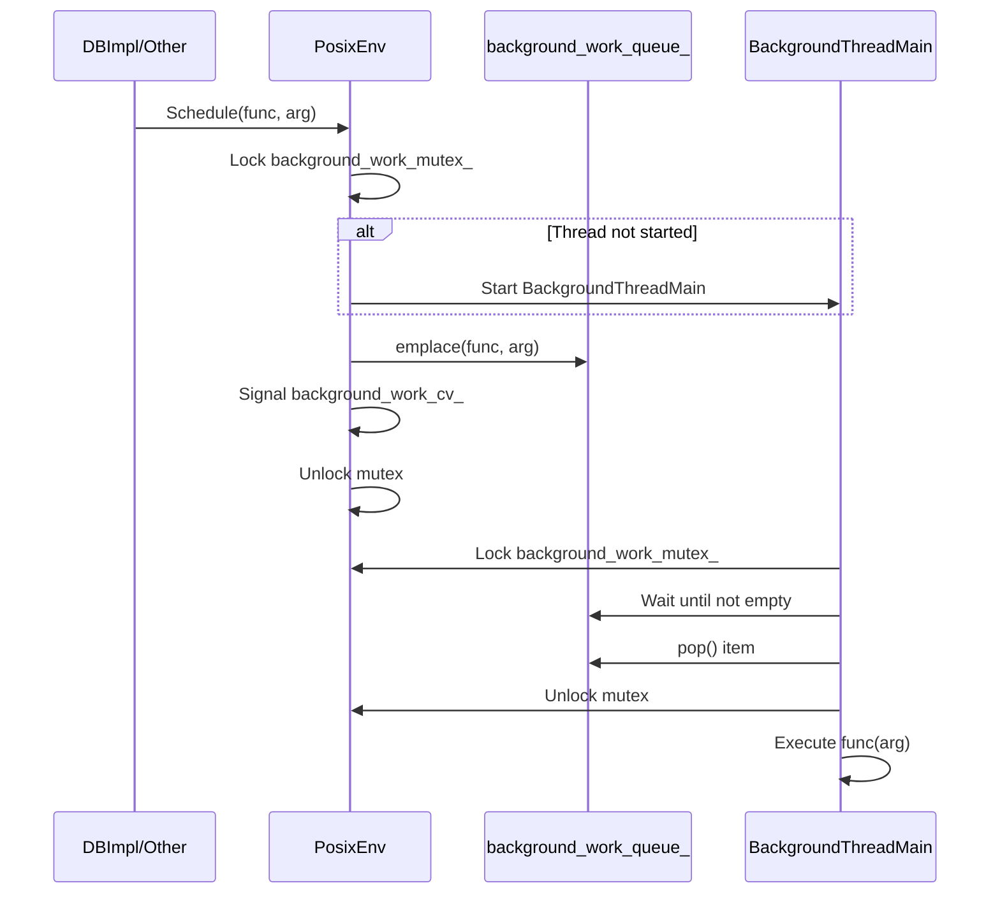

### File Overview
`util/env_posix.cc` provides the POSIX-compliant implementation of the `Env` interface, abstracting filesystem operations, threading, and time for Unix-like systems. It serves as the primary bridge between LevelDB's platform-independent logic and the underlying OS, as evidenced by its implementation of `NewRandomAccessFile`, `NewWritableFile`, and `Schedule`.

### Key Symbol Annotations
- `Limiter` — A thread-safe resource counter used to prevent the exhaustion of file descriptors and mmap regions.
- `PosixSequentialFile` — Implements `SequentialFile` using standard `read()` and `lseek()` calls.
- `PosixRandomAccessFile` — Implements `RandomAccessFile` using `pread()`, with an optimization to close the FD if the `Limiter` denies a permanent handle.
- `PosixMmapReadableFile` — A high-performance `RandomAccessFile` implementation that maps files into memory via `mmap()`.
- `PosixWritableFile` — Implements `WritableFile` with an internal 64KB buffer to reduce the number of system calls.
- `PosixLockTable` — A process-wide registry of locked files to prevent the same process from attempting to lock the same file multiple times (which `fcntl` does not protect against).
- `PosixEnv` — The concrete implementation of the `Env` interface, managing the background worker thread and resource limiters.
- `SingletonEnv` — A template wrapper that uses placement `new` to create a singleton `Env` without ever calling its destructor, avoiding crashes during process exit.

### Design Patterns & Engineering Practices
- **Resource Limiting (The Limiter Class):** Instead of blindly opening files, LevelDB uses a `Limiter` to track `mmap` regions and file descriptors. If `Acquire()` fails, `PosixRandomAccessFile` falls back to opening/closing the file on every read, trading performance for stability.
- **Buffered I/O:** `PosixWritableFile` implements a manual write buffer (`buf_[kWritableFileBufferSize]`). It optimizes by buffering small writes and bypassing the buffer for writes larger than 64KB to avoid unnecessary `memcpy` operations.
- **Durability Guarantees:** The `SyncFd` method demonstrates deep OS knowledge by using `F_FULLFSYNC` on macOS/iOS, as `fsync` is insufficient to guarantee durability against power failures on those platforms.
- **Pimpl-like Interface Separation:** By inheriting from the abstract `Env` class, the rest of the codebase remains agnostic of POSIX specifics, allowing for the `memenv` (in-memory environment) used in tests.
- **Avoidance of Static Destruction Order Issues:** The `SingletonEnv` class uses a `char` array (`env_storage_`) and placement `new`. This ensures the `Env` is allocated in static memory but its destructor is never called, preventing "static destruction order fiasco" where the `Env` might be destroyed before other components that still need it.
- **Thread-Safe Background Queue:** `PosixEnv::Schedule` implements a classic Producer-Consumer pattern using a `std::queue`, `port::Mutex`, and `port::CondVar` to handle asynchronous background tasks (like compaction).

### Internal Flow
The following diagram describes how `PosixEnv` handles background work scheduling:

### Questions
- **Line 311:** `is_manifest_ = IsManifest(filename)`. The logic for `IsManifest` simply checks if the filename starts with "MANIFEST". It is unclear if this naming convention is strictly enforced across all LevelDB versions or if it's a fragile heuristic.
- **Line 474:** The `PosixEnv` destructor calls `std::abort()`. While the comment says "Unsupported behavior!", it would be useful to know why a graceful shutdown of the `PosixEnv` singleton is intentionally avoided.
