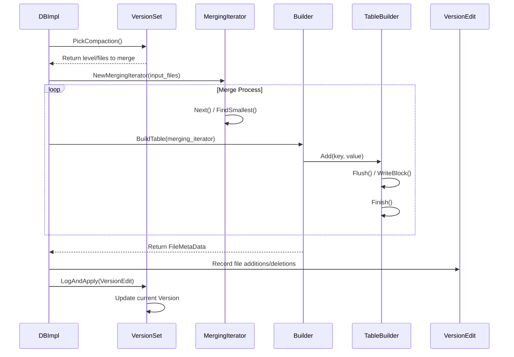

# Workflow Documentation: Compaction Cycle

### Overview
The Compaction Cycle is a critical background process in LevelDB that merges SSTables from higher levels (L0) to lower levels (L1...Ln) to reclaim disk space and optimize read performance. By merging overlapping files, it removes obsolete keys (overwrites) and deletion markers (tombstones), reducing read amplification. This process is orchestrated by `DBImpl` and persists metadata changes via the `VersionSet`.

### Sequence

### Step-by-step
1. **Trigger & Selection**: `DBImpl::BackgroundCompaction` (in `db/db_impl.cc`) determines if a compaction is needed. It calls `VersionSet::PickCompaction` (`db/version_set.cc`) to identify which level is overloaded and which SSTables should be merged.
2. **Iterator Setup**: `DBImpl` creates a `MergingIterator` via `NewMergingIterator` (`table/merger.cc`). This iterator wraps multiple SSTables, providing a single sorted stream of keys across the selected files.
3. **Table Construction**: `DBImpl` calls `BuildTable` (`db/builder.cc`), which initializes a `TableBuilder` (`table/table_builder.cc`).
4. **Merging & Filtering**: As `BuildTable` iterates through the `MergingIterator`, it filters out obsolete keys. If a key appears multiple times, only the one with the highest sequence number is kept. Deletion markers are dropped if they reach the bottom-most level.
5. **Physical Write**: `TableBuilder::Add` appends data to blocks. When a block is full, `TableBuilder::Flush` and `WriteRawBlock` commit the compressed data and CRC checksums to disk.
6. **Finalization**: `TableBuilder::Finish` writes the filter block, index block, and footer to complete the SSTable. `BuildTable` then verifies the file is readable via the `table_cache`.
7. **Metadata Update**: `DBImpl` creates a `VersionEdit` (`db/version_edit.cc`) to record which old SSTables are deleted and which new ones are added.
8. **Atomic Commit**: `VersionSet::LogAndApply` (`db/version_set.cc`) writes the `VersionEdit` to the `MANIFEST` log and updates the current `Version` object, making the new SSTables live for readers.

### Invariants & Failure Modes
- **Immutability Invariant**: The `Version` object is immutable. Reads continue using the old `Version` while compaction creates a new one, ensuring no locks are held during the heavy I/O of `DoCompactionWork`.
- **Atomicity**: The use of `VersionEdit` and the `MANIFEST` ensures that a compaction is either fully applied or not applied at all.
- **Failure Handling**: If `BuildTable` fails (e.g., disk full), `env->RemoveFile` is called to delete the partial SSTable, preventing corrupted files from entering the `VersionSet`.
- **Crash Recovery**: If the system crashes during compaction, the `MANIFEST` will not contain the `VersionEdit`. Upon restart, `VersionSet::Recover` ignores the orphaned partial files, which are later cleaned up by `RemoveObsoleteFiles`.

### Open Questions
- **Tombstone Deletion**: In `DoCompactionWork`, the exact logic for determining when a deletion marker is "safe" to drop (the base level check) needs further verification to ensure it doesn't break reads for very old snapshots.
- **Linear Scan Overhead**: `MergingIterator` uses a linear scan $O(n)$ to find the smallest key. It is unclear at what number of files ($n$) this becomes a bottleneck compared to a priority queue/heap implementation.
- **Heuristic Tuning**: The `allowed_seeks` calculation in `VersionSet` (file size / 16KB) appears to be a heuristic; it is unclear if this is optimized for specific hardware (SSD vs HDD).
