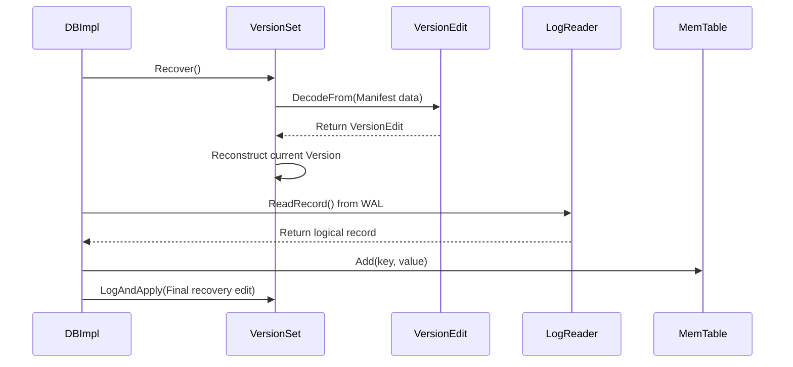

# Workflow: Crash Recovery

### Overview
Crash Recovery is the critical startup process that restores the database to a consistent state after an unclean shutdown. It reconstructs the LSM-tree metadata by replaying the `MANIFEST` log and recovers any data lost from memory by replaying the Write-Ahead Log (WAL) into a new `MemTable`.

### Sequence

### Step-by-step
1. **Initiation**: The process begins in `DBImpl::Recover` (`db/db_impl.cc`), which is called during the database opening sequence.
2. **Metadata Reconstruction**: `DBImpl` invokes `VersionSet::Recover` (`db/version_set.cc`). This reads the `MANIFEST` file to determine which SSTables are currently active and their respective levels.
3. **Manifest Parsing**: For every record in the manifest, `VersionEdit::DecodeFrom` (`db/version_edit.cc`) is used to deserialize the changes (files added or deleted) into `VersionEdit` objects.
4. **Version State Application**: `VersionSet` applies these edits to build the most recent `Version` object, effectively recreating the LSM-tree structure in memory.
5. **WAL Replay**: `DBImpl` identifies the most recent WAL files. It uses `Reader::ReadRecord` (`db/log_reader.cc`) to parse the raw bytes of the log into logical write records.
6. **MemTable Restoration**: As records are read from the WAL, `DBImpl` calls `MemTable::Add` (`db/memtable.cc`) to re-insert the data into a new `MemTable`. This ensures that writes that were acknowledged to the user but not yet flushed to an SSTable are not lost.
7. **Finalization**: Once the WAL is fully replayed, the database marks the recovery as complete and opens for new requests.

### Invariants & Failure Modes
- **Metadata Atomicity**: The `MANIFEST` is the source of truth. If the manifest is corrupted, the `VersionSet` cannot be reconstructed, and the database is considered corrupted (requiring `repair`).
- **WAL Idempotency**: Replaying the WAL is safe because the `SequenceNumber` associated with each write ensures that if a write was already flushed to an SSTable before the crash, the newer version in the `MemTable` will correctly supersede it.
- **Partial Record Handling**: `LogReader` handles truncated records at the end of the WAL (common during crashes). It uses CRC checksums to detect corruption; if a record is partially written, it is discarded, and the database recovers up to the last valid record.
- **Memory Pressure**: During recovery, the replayed WAL is inserted into a `MemTable`. If the WAL is exceptionally large, this could trigger a flush to L0 immediately after recovery.

### Open Questions
- **Manifest Corruption**: While `VersionEdit::DecodeFrom` returns `Status::Corruption`, the exact mechanism by which `DBImpl` decides whether to attempt a partial recovery or fail entirely is not explicitly detailed in the provided annotations.
- **WAL-Manifest Synchronization**: The exact ordering of when the `MANIFEST` is updated relative to the WAL flush during normal operation determines exactly how much "overlap" occurs during recovery.
