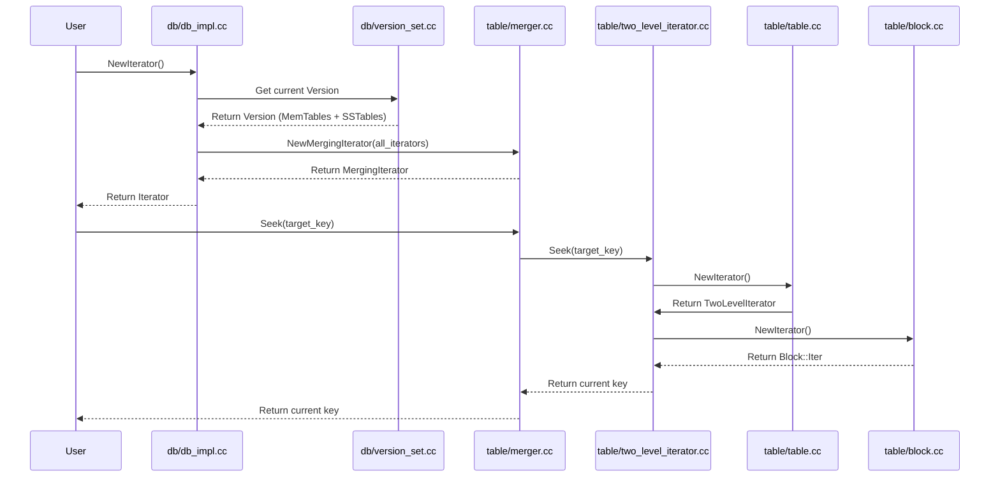

# Workflow: Range Scan

### Overview
The Range Scan workflow allows a user to iterate over a sorted range of keys across the entire LSM-tree. It orchestrates a unified view that merges data from the in-memory MemTables and multiple on-disk SSTables, ensuring that only the most recent version of any given key is returned.

### Sequence

### Step-by-step
1. **Iterator Initialization**: The process begins in `DBImpl::NewIterator` (`db/db_impl.cc`), which captures a snapshot of the current `Version` (the set of live MemTables and SSTables).
2. **Iterator Collection**: `DBImpl` creates individual iterators for the current MemTable, any immutable MemTables, and every SSTable file tracked by the `Version`.
3. **Merging**: These individual iterators are passed to `NewMergingIterator` (`table/merger.cc`). This creates a `MergingIterator` that acts as a priority-queue-like coordinator, presenting the smallest key across all sources.
4. **SSTable Entry**: When the `MergingIterator` requests a key from an SSTable, it interacts with a `TwoLevelIterator` (`table/two_level_iterator.cc`).
5. **Index Lookup**: The `TwoLevelIterator` first seeks within the `Table`'s index block (`table/table.cc`) to find which data block might contain the target key.
6. **Block Loading**: The `TwoLevelIterator` calls the `BlockReader` (defined in `table/table.cc`), which checks the `block_cache` or reads the raw bytes from disk.
7. **Data Decoding**: A `Block::Iter` (`table/block.cc`) is created for the loaded block. It uses the "restart points" to binary search for the key and then performs a linear scan of the prefix-compressed entries to find the exact match.
8. **Result Propagation**: The `Block::Iter` returns the key to the `TwoLevelIterator`, which returns it to the `MergingIterator`, which finally presents it to the user.

### Invariants & Failure Modes
- **Version Consistency**: The iterator is bound to a specific `Version`. Even if background compaction deletes SSTables or flushes MemTables, the `Version` object maintains reference counts on those files, ensuring they are not deleted until the iterator is destroyed.
- **Key Uniqueness**: The `MergingIterator` ensures that if a key exists in both a MemTable and an SSTable, the one with the higher sequence number (the newer one) is prioritized.
- **Corruption Failure**: If `Block::Iter` encounters an invalid prefix-compressed length or a missing restart point, it returns a `CorruptionError` via the `status()` method, which propagates up to the user.
- **Memory Pressure**: Because data blocks are loaded lazily and managed via the `block_cache`, a range scan over a massive dataset will not exhaust memory, though it may cause "cache thrashing."

### Open Questions
- **Linear Scan Threshold**: In `table/merger.cc`, the code uses a linear scan $O(n)$ to find the smallest key among child iterators. It is unclear at what number of SSTables ($n$) this becomes a bottleneck compared to a heap-based approach.
- **Handle Stability**: In `table/two_level_iterator.cc`, the `data_block_handle_` is assigned from a `Slice`. It is not explicitly clear if the underlying memory of that slice is guaranteed to remain stable if the index iterator moves.
