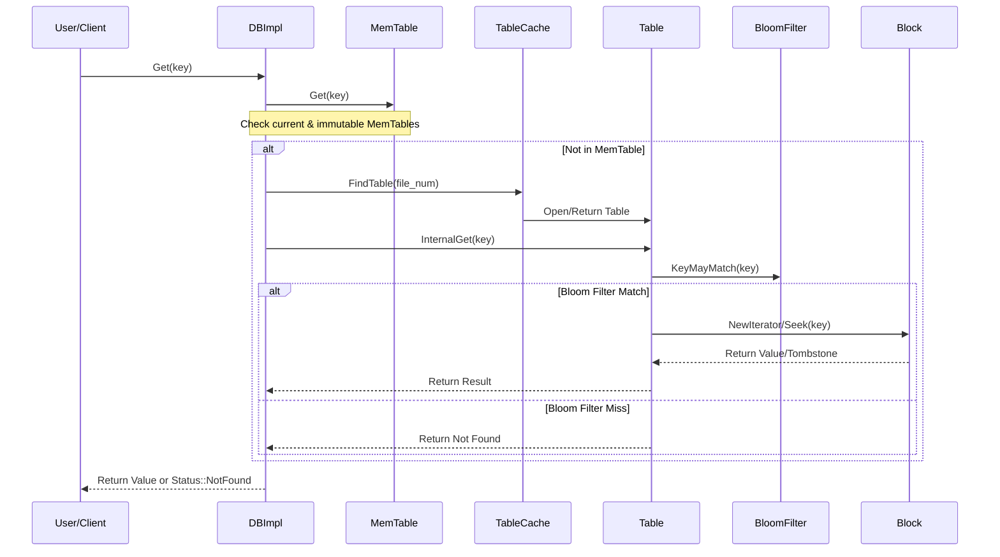

# Workflow: Read Path

### Overview
The Read Path is the process of retrieving a value associated with a specific key from the LSM-tree. It orchestrates a hierarchical search starting from the most recent in-memory data (MemTable) and descending through progressively older on-disk layers (SSTables) to ensure the most recent version of a key is returned.

### Sequence

### Step-by-step
1. **Entry Point**: The request enters via `DBImpl::Get` (`db/db_impl.cc`), which acquires a snapshot of the current database state.
2. **Memory Search**: `DBImpl` first queries the active `MemTable` and any `Immutable MemTables` using `MemTable::Get` (`db/memtable.cc`). Because these are sorted skiplists, this is a fast $O(\log N)$ operation.
3. **SSTable Orchestration**: If not found in memory, `DBImpl` iterates through the `Version` (managed by `VersionSet`) to identify which SSTables might contain the key, searching from the newest level (L0) to the oldest.
4. **Table Retrieval**: For each candidate SSTable, `DBImpl` requests a table handle from `TableCache::FindTable` (`db/table_cache.cc`), which either returns a cached handle or opens the file from disk.
5. **Membership Filtering**: Inside `Table::InternalGet` (`table/table.cc`), the system queries the `BloomFilterPolicy::KeyMayMatch` (`util/bloom.cc`). If the filter returns `false`, the SSTable is skipped entirely without disk I/O.
6. **Index Lookup**: If the filter matches, `Table` searches its in-memory `index_block` to find the specific data block offset where the key should reside.
7. **Block Decoding**: The `Table` uses `BlockReader` to fetch the block (from `block_cache` or disk) and creates a `Block::Iter` (`table/block.cc`).
8. **Binary Search & Scan**: `Block::Iter::Seek` performs a binary search on the block's restart points, followed by a linear scan of prefix-compressed entries to locate the exact key.
9. **Result Return**: The value (or a deletion tombstone) is returned up the chain to `DBImpl`, which then returns the final result to the user.

### Invariants & Failure Modes
- **Version Invariant**: The read path must always search from newest to oldest (MemTable $\rightarrow$ Immutable MemTable $\rightarrow$ L0 $\rightarrow$ L1... $\rightarrow$ Ln). This ensures that if a key was overwritten or deleted, the most recent sequence number is encountered first.
- **Snapshot Isolation**: Reads are tied to a `SequenceNumber`. Any write occurring after the `Get` operation started is ignored, ensuring a consistent view of the data.
- **Bloom Filter False Positives**: The system accepts that Bloom filters may return "True" for keys not present. This results in a "wasteful" disk read but never results in a missing value (no false negatives).
- **Corruption Failure**: If `Block::Iter` encounters an invalid restart point or malformed varint during the scan, it returns a `CorruptionError`, signaling that the SSTable on disk is damaged.

### Open Questions
- **Filter Overhead**: As noted in `table/table.cc` (Line 87), there is a TODO regarding skipping the metaindex if the size indicates no filter exists; it is unclear if this currently causes measurable overhead for tables without filters.
- **Filter Memory Safety**: In `Table::ReadFilter` (`table/table.cc` Line 118), `rep_->filter_data` is assigned a raw pointer from a `std::string`. The exact lifetime guarantee of that string relative to the `Table::Rep` needs verification to ensure no use-after-free occurs.
