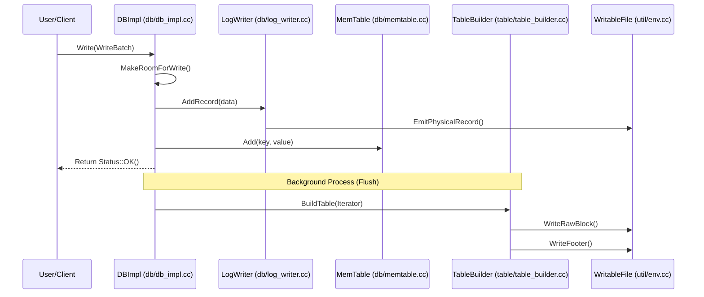

# Workflow Documentation: Write Path

### Overview
The Write Path is the critical pipeline that ensures data durability and availability in LevelDB. It transforms a user's key-value update into a persistent record by sequentially passing it through a Write-Ahead Log (WAL) for crash recovery and an in-memory MemTable for fast access, eventually flushing the data to disk as an immutable SSTable.

### Sequence

### Step-by-step
1. **Request Orchestration**: The process begins in `DBImpl::Write` (`db/db_impl.cc`), where concurrent writes are grouped into batches to amortize disk I/O costs.
2. **Capacity Check**: `DBImpl::MakeRoomForWrite` (`db/db_impl.cc`) ensures the current `MemTable` isn't full and that the number of L0 SSTables hasn't exceeded the limit. If limits are hit, it triggers a background flush or compaction.
3. **Durability (WAL)**: The write is passed to the `Writer` class in `db/log_writer.cc`. The `AddRecord` function fragments the data into physical records (with CRC checksums and headers) and calls `EmitPhysicalRecord` to append them to the `WritableFile` on disk.
4. **In-Memory Indexing**: Once persisted to the log, `MemTable::Add` (`db/memtable.cc`) allocates a contiguous block from an `Arena` to store the internal key (user key + sequence number + type) and the value, then inserts a pointer to this block into a sorted skiplist.
5. **Persistence (Flush)**: When a `MemTable` is full, it is marked as immutable. A background thread calls `BuildTable` (`db/builder.cc`), which utilizes `TableBuilder` (`table/table_builder.cc`) to iterate through the sorted memory entries.
6. **SSTable Construction**: `TableBuilder::Add` (`table/table_builder.cc`) packs the data into blocks. Once a block is full, `WriteRawBlock` commits the compressed data and CRC to the `WritableFile`.
7. **Finalization**: `TableBuilder::Finish` (`table/table_builder.cc`) writes the filter block, index block, and the final footer, making the SSTable a complete, searchable unit on disk.

### Invariants & Failure Modes
*   **WAL-First Invariant**: Data must be successfully written to the WAL before being inserted into the `MemTable`. This ensures that if the process crashes before a flush, the `MemTable` can be reconstructed during `DBImpl::Recover`.
*   **Ordering Invariant**: Every write is assigned a monotonically increasing `SequenceNumber`. This allows the system to distinguish between different versions of the same key across the `MemTable` and various SSTable levels.
*   **Failure - Disk Full/IO Error**: If `LogWriter` or `TableBuilder` encounters a filesystem error, the operation returns a non-OK `Status`. During a flush, if `BuildTable` fails, the partial file is deleted via `env->RemoveFile` to prevent corruption.
*   **Failure - Crash**: If the system crashes after the WAL write but before the `MemTable` update, the WAL acts as the source of truth during recovery.

### Open Questions
*   **WAL Performance**: `log_writer.cc` calls `dest_->Flush()` after every physical record; it is unclear if the underlying `WritableFile` implementation provides internal buffering to prevent this from becoming a severe IOPS bottleneck.
*   **Empty Tables**: In `db/builder.cc`, a file size of 0 is treated as a failure. It is unclear if the LSM-tree architecture explicitly forbids the creation of empty SSTables or if this is simply a safety check.
*   **Index Optimization**: The use of `FindShortestSeparator` in `TableBuilder` suggests a complex interaction with the `Comparator` to minimize index size; the specific logic for this "shortest separator" is not detailed in the write-path annotations.
